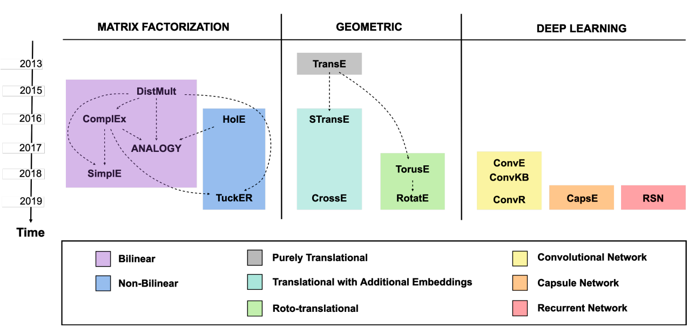
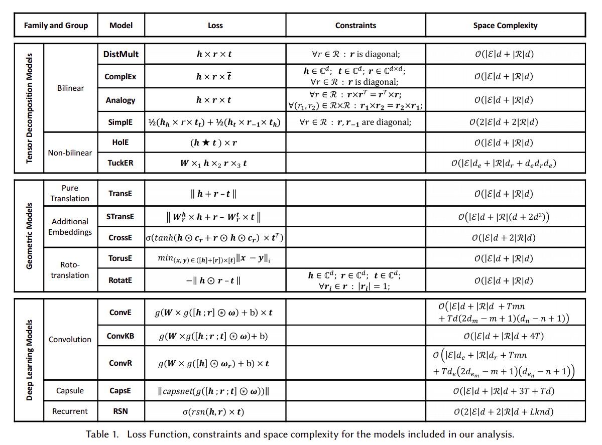

# OVERVIEW OF LINK PREDICTION TECHNIQUES
Table content

* [Tensor Decomposition Models](#3.1TensorDecompositionModels)
* [3.1.1 Bilinear Models](#BilinearModels)

Trong phần này, chúng ta khảo sát và thảo luận về các phương pháp LP chính cho KG dựa trên các đặc trưng ẩn. Như đã mô tả trong Phần 2, các mô hình LP có thể khai thác rất nhiều cách tiếp cận và kiến trúc khác nhau, tùy thuộc vào cách mô hình hóa vấn đề tối ưu hóa và các kỹ thuật họ thực hiện để giải quyết nó.

Để tổng quan các đặc điểm rất đa dạng của chúng, Bài báo đề xuất một phân loại mới được minh họa trong Hình 1. Bài báo tạo ra ba họ chính của các mô hình và tiếp tục chia mỗi nhóm thành các nhóm nhỏ hơn, xác định bằng các màu độc đáo. Đối với mỗi nhóm, bao gồm các mô hình đại diện hợp lệ nhất, ưu tiên các mô hình đạt hiệu suất hiện đại và, bất cứ khi nào có thể, những mô hình có triển khai công khai. Kết quả là một bộ gồm 16 mô hình dựa trên các kiến trúc vô cùng đa dạng; đây là những mô hình mà sau đó Bài báo sử dụng trong các phần thử nghiệm phân tích so sánh trong bài báo. Đối với mỗi mô hình, Bài báo cũng báo cáo năm xuất bản cũng như các thông tin mà nó đã nhận được từ các mô hình khác. Bài báo tin rằng phân loại này tạo điều kiện cho sự hiểu biết về các mô hình này và về các thí nghiệm được thực hiện trong công việc nghiên cứu.

> Phân loại cho các mô hình LP có trong phân tích của bài báo. Mũi tên được chỉ ra rằng phương thức đích xây dựng trên phương thức nguồn bằng cách khái quát hóa hoặc chuyên môn hóa định nghĩa của hàm cho điểm của nó. Các mô hình bao gồm là: [DistMult-71](../papers/71_Embedding_Entities_and_Relations_for_Learning_and_Inference_in_Knowledge_Bases.pdf);[ComplEx-61](../papers/61_Complex_Embeddings_for_Simple_Link_Prediction.pdf); [ANALOGY-35](../papers/35_Analogical_Inference_for_Multi-relational_Embeddings.pdf); [SimplE-27](../papers/27_SimplE_Embedding_for_Link_Prediction_in_Knowledge.pdf); [HolE-46](../papers/46_Holographic_Embeddings_of_Knowledge_Graphs.pdf); [TuckER-6](../papers/6_TuckER_Tensor_Factorization_for_Knowledge_Graph_Completion.pdf); [TransE-8](../papers/8_Translating_Embeddings_for_Modeling.pdf);[STransE-41](../papers/41_STransE_a_novel_embedding_model_of_entities_and_relationships_in_knowledge_bases.pdf); [CrossE-72](../papers/72_Interaction_Embeddings_for_Prediction_and_Explanation_in_Knowledge_Graphs.pdf); [TorusE-13](../papers/13_TorusE_Knowledge_Graph_Embedding_on_a_Lie_Group.pdf); [RotatE-55](../papers/55_Yago_a_core_of_semantic_knowledge.pdf); [ConvE-11](../papers/11_Convolutional_2D_Knowledge_Graph_Embeddings.pdf); [ConvKB-42](../papers/42_A_Novel_Embedding_Model_for_Knowledge_Base_Completion_Based_on_Convolutional_Neural_Network.pdf); [ConvR-25](../papers/25_Adaptive_Convolution_for_Multi-Relational_Learning.pdf); [CapsE-43](../papers/43_A_Capsule_Network-based_Embedding_Model_for_Knowledge_Graph_Completion_and_Search_Personalization.pdf); [RSN-19](../papers/19_Learning_to_Exploit_Long-term_Relational_Dependencies_in_Knowledge_Graphs.pdf)

Thông tin thêm về các mô hình được bao gồm, chẳng hạn như hàm mất mát **loss function** và độ phức tạp không gian của chúng, được báo cáo trong Bảng 1.

Trong phân tích của bài báo tập trung vào phần lõi cho các hệ thống học từ cấu trúc KG.  bài báoi giới thiệu người đọc thảo luận về cách tận dụng các nguồn thông tin bổ sung, chẳng hạn như textual captions [58], [65], [3], images [70] hoặc pre-computed rules [20]; xem [survey exclusive -18](../papers/18_A_Comprehensive_Survey_of_Knowledge_Graph.pdf) để biết khảo sát dành riêng cho các mô hình này.

Bài báo xác định ba họ chính của các mô hình: 1)*Tensor Decomposition Models*; 2) *Geometric Models*; 3) *Deep Learning Models*.

### 3.1TensorDecompositionModels
## 3.1 Tensor Decomposition Models

Các mô hình trong họ này giải thích LP là một nhiệm vụ [tensor decomposition-28](../papers/28_Tensor_Decompositions_and.pdf). Các mô hình của họ này hoàn toàn coi KG là ma trận kề 3D (nghĩa là một **3-way tensor)**), chỉ có thể quan sát được một phần do sự không hoàn chỉnh của KG. **tensor** được phân tách thành một tổ hợp (ví dụ: một tích đa tuyến tính-*multi-linear product*) của các vectơ có chiều thấp *low-dimensional vectors*: các vectơ như vậy được sử dụng làm nhúng-*embeddings* cho các thực thể và quan hệ. Ý tưởng cốt lõi là, với điều kiện là mô hình không *overfit* trên tập huấn luyện, các *embeddings* được học sẽ có thể khái quát hóa và liên kết các giá trị cao với các sự kiện-facts không xác thực trong ma trận kề của đồ thị. Trong thực tế, điểm số của mỗi facts được tính toán hoạt động kết hợp trên các *embeddings* cụ thể liên quan đến facts đó; các *embeddings* được học như bình thường bằng cách tối ưu hóa hàm cho điểm cho tất cả các training facts. Các mô hình có xu hướng sử dụng ít hoặc không có tham số chia sẻ-*shared parameters* nào cả; điều này làm cho chúng đặc biệt nhẹ và dễ huấn luyện.

#### BilinearModels
### 3.1.1 Bilinear Models
